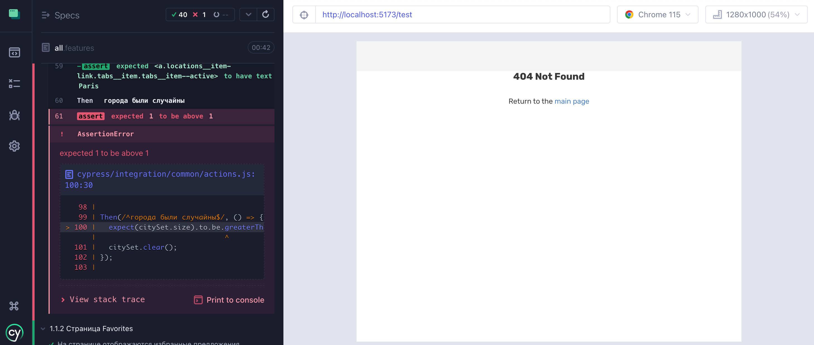

# Автоматические e2e тесты для проекта «Шесть городов»

## Установка тестов

1. Склонируйте репозиторий и перейдите в созданную директорию.

2. Установите зависимости командой `npm install`.

## Тестирование проекта

1. Откройте терминал и перейдите в директорию с проектом «Шесть городов». Запустите проект командой `npm start`. Обратите внимание, по какому адресу стартовал проект.

2. Откройте файл [cypress.config.js](cypress.config.js) и убедитесь, что в настройке `baseUrl` указан тот же URL, на котором доступен «Шесть городов». Если адрес отличается, измените настройку.

3. Не останавливая работу «Шесть городов», откройте новое окно (или вкладку) терминала и перейдите в директорию с тестами. Запустите Cypress командой `npm test`.

4. В открывшемся окне выберите вариант `E2E Testing`.

5. Теперь выберите браузер, в котором хотите протестировать проект.

> На данный момент поддержка WebKit экспериментальная, тесты могут работать нестабильно.

6. Выберите одну из предложенных спецификаций:

    - all - запустит все тесты;
    - extra - запустит тестирование дополнительной функциональности (пункт 3);
    - favorites-page - запустит тестирование страницы избранного (пункт 1.1.2);
    - login-page - запустит тестирование страницы входа (пункт 1.1.3);
    - main-page - запустит тестирование главной страницы (пункт 1.1.1);
    - main-page.list - запустит тестирование списка предложений на главной странице (пункт 1.1.1.1);
    - main-page.map - запустит тестирование карты на главной странице (пункт 1.1.1.2);
    - offer-page - запустит тестирование страницы предложения (пункт 1.1.2);
    - offer-page.review-form - запустит тестирование формы отправки отзыва на странице предложения (пункт 1.1.2.2);
    - offer-page.reviews - запустит тестирование отзывов на странице предложения (пункт 1.1.2.1);
    - pages - запустит тестирование маршрутизации приложения (пункт 1.1).

Номер рядом со сценарием означает пункт технического задания, который проверяется в данном сценарии.

Вы можете изменить браузер, не выходя в главное меню. Тесты выбранной спецификации запустятся в новом браузере автоматически.

Если на одном из шагов сценария произошла ошибка, Cypress прекратит выполнение данного сценария и перейдёт к следующему.

Вы можете развернуть описание шага и узнать, что пошло не так.

